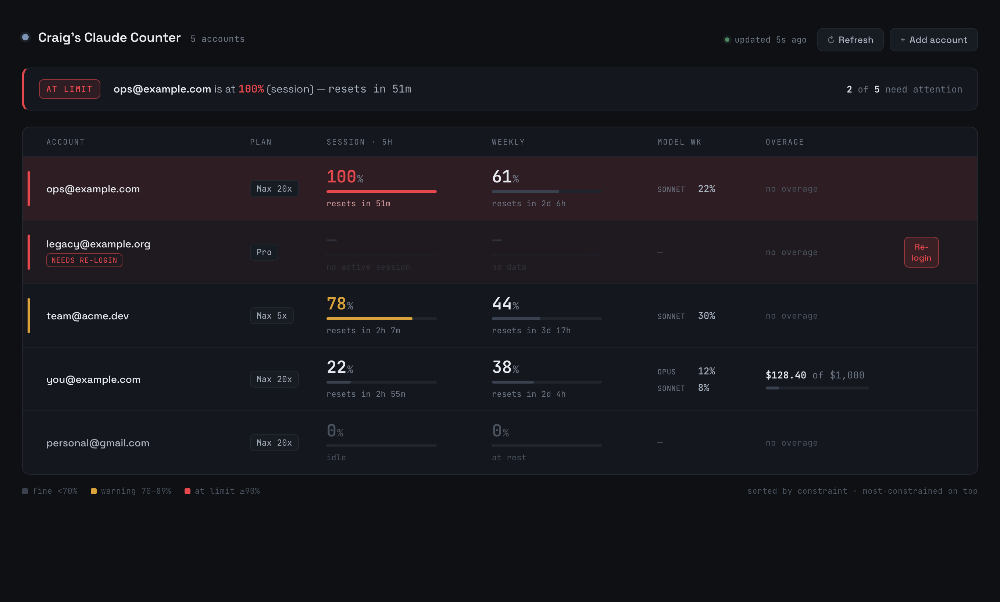

# Craig's Claude Counter

**One calm, glanceable view of your Claude Code usage limits across every account you have.**

Run more than one Claude subscription — or just want to know how close you are to your 5‑hour and weekly limits before you hit the wall? This watches them all and tells you the one thing that matters: *is anything about to run out, and when does it reset?*



It's deliberately quiet: the board stays neutral until an account nears a limit, so the one that's actually maxed is the only red thing on screen. There are three ways to look at it — a built‑in **web dashboard**, a **native macOS app**, and a **desktop widget** — all reading one small local engine.

> Not affiliated with Anthropic. It only ever reads *your own* usage, via the public Claude Code OAuth client (the same one the official CLI uses). Requires **macOS** (tokens live in the Keychain) and **Node 18+**.

## Get started

### 1. Start the engine (this is all you need)

```bash
git clone https://github.com/CraigVG/craigs-claude-counter.git
cd craigs-claude-counter
npm start          # zero dependencies — pure Node
```

It prints a local URL (`http://127.0.0.1:4319`) plus your Tailscale IP. Open it, click **+ Add account**, sign into each account once (paste back the code Claude shows you). That's it — tokens are stored in your Keychain and stay logged in.

- **Keep it running** at login: `./scripts/install-service.sh` (a macOS LaunchAgent; remove with `./scripts/uninstall-service.sh`).
- **Check from your phone/iPad** over [Tailscale](https://tailscale.com): use the `…ts.net:4319` URL it prints, or `tailscale serve --bg 4319` for HTTPS.
- **Just looking?** `http://127.0.0.1:4319/?demo=1` previews it with fake data — no sign‑in.

### 2. Add the native macOS app + desktop widget (optional)

```bash
brew install --cask CraigVG/tap/craigs-claude-counter
# first time only, if Homebrew asks: brew trust craigvg/tap
```

(Or grab the notarized `.dmg` from [Releases](https://github.com/CraigVG/craigs-claude-counter/releases/latest).) Launch it, then add the widget: right‑click the desktop → **Edit Widgets** → search **Claude Counter** (small / medium / large).

The app and widget are the same Status Board rendered natively in SwiftUI; they read the engine from step 1, so keep it running for live data.

## What it shows, per account

- **Session (5h)** and **Weekly** utilization — percentages with live reset countdowns
- **Per‑model weekly sub‑limits** (Opus / Sonnet) and **overage** spend, when active
- Auto‑detected plan tier (Max 20× / Max 5× / Pro)
- A top summary — how many accounts need attention and the single most‑pressing fact. The board lists the most available account first and the most constrained last
- A **fleet bar** — every account folded into one capacity‑weighted number (see below), split into what is free now, what comes back within the next 5 hours, and what stays locked until a weekly reset, plus a schedule of the next resets and a weekly burn‑rate check
- **Compact mode** — one line per account so many accounts fit without scrolling. Auto‑enabled when the normal rows would overflow the window; pin it either way with the **Compact** button (⌘⇧K in the app). `?demo=many` previews it with 12 fake accounts.

## The fleet bar (how "total usage" is computed)

Percentages from different plans are not comparable, and within one account the 5‑hour and weekly windows are not additive. The fleet bar deals with both:

- **Each account is weighted by its plan's weekly capacity**, because the bar answers "how much work can the fleet do this week". The 5x / 20x multipliers describe the 5‑hour session bucket; the weekly buckets are closer together — a Max 20x week is about 2× a Max 5x week, and a Max 5x week about 3.5× a Pro week — so the weights are Max 20x = 7, Max 5x = 3.5, Pro = 1. Session limits do not change an account's share; they act as throttles that take it out of rotation until the session resets. An unknown plan is weighted as Max 5x and flagged.
- **An account's effective usage is its binding window** — `max(session, weekly, per‑model weekly)`, because that is the one that blocks it. Fleet usage is the weighted mean of effective usage; "free now" is the weighted headroom.
- **Time is folded in through resets.** Both windows drop to zero at their reset time, so each account contributes at most two relief events. Played in time order they say exactly how much fleet capacity each reset gives back (after the earlier reset the account is still bound by the later window). Used capacity is then split into **back within 5h** (hatched) and **locked until a weekly reset** (solid). The `Next` line lists the soonest events and when every weekly window will have rolled over.
- **Weekly burn vs. pace** compares each weekly window's usage with the share of that window already elapsed (87% used with 29% of the week gone is 3× pace). The tick on the bar marks where fleet usage would sit if it were exactly on pace, and accounts projected to run out before their reset at the current rate are counted.

The same numbers are in `GET /api/usage` under `fleet` and at the top of `claude-usage`; the logic lives in `src/fleet.mjs` and is served to the page as `/fleet.mjs` so both use identical code.

## How it works (and why it's safe)

Reads the same endpoint the `claude` CLI's `/usage` uses (`GET /api/oauth/usage`) with each account's OAuth token.

- **Tokens live only in the macOS Keychain** — never on disk in plaintext, never logged, never committed.
- **Single‑flight refresh** — a rotating refresh token is never spent twice (which would trip Anthropic's reuse‑detection), and a background keep‑alive refreshes tokens before they lapse, so accounts stay logged in for months.
- **Tailnet‑private, never public** — binds to your Tailscale IP and `127.0.0.1`, never `0.0.0.0`. Don't put it behind a public URL: the stored tokens grant access to each subscription.
- Only `api.anthropic.com`, `claude.ai`, and `platform.claude.com` are ever contacted.

## Configuration

All optional (sensible defaults; nothing required):

| Variable | Default | What it does |
|---|---|---|
| `CLAUDE_USAGE_PORT` | `4319` | Port to listen on |
| `CLAUDE_USAGE_BIND` | auto (Tailscale IP, else `127.0.0.1`) | Bind host |
| `CLAUDE_USAGE_CACHE_MS` | `60000` | Min interval between upstream fetches per account |
| `CLAUDE_USAGE_WARN` / `_CRIT` | `70` / `90` | Severity thresholds (%) |
| `CLAUDE_USAGE_HISTORY_MS` | `300000` (5 min) | How often the engine logs every account's limits to the history (`0` disables) |
| `CLAUDE_USAGE_HISTORY_DIR` | `<repo>/history` | Where the history JSONL files live |
| `CLAUDE_USAGE_HISTORY_DAYS` | `90` | Days of history to keep before day files are pruned |

## Usage history (for agents and trend questions)

The engine polls every account on its own timer (default every 5 minutes, dashboard open or not) and appends one record per account to `history/usage-YYYY-MM-DD.jsonl` (UTC day files, 90 days kept). Only labels, tiers, percentages, reset times and overage dollars are logged, never tokens.

One record looks like:

```json
{"ts":"2026-09-08T18:40:00.000Z","account":"acct_…","label":"craig@drillerdb.com","tier":"Max 20x",
 "session":{"pct":0,"resetsAt":null},"weekly":{"pct":100,"resetsAt":"2026-09-11T05:00:00Z"},
 "models":[{"name":"Fable","pct":48,"resetsAt":"2026-09-11T05:00:00Z"}],
 "overage":{"usedUsd":600.92,"limitUsd":615,"pct":98},"stale":false,"error":null}
```

Read it back from the running engine:

| Call | What you get |
|---|---|
| `GET /api/history?since=7d` | Raw records, oldest first. Filters: `account=<id or label substring>`, `since`/`until` (`24h`, `7d`, ISO time), `step=1h` (one sample per account per hour), `limit=N` (most recent N, default 5000, `0` for all), `format=json\|jsonl\|csv` |
| `GET /api/history/summary?since=7d` | Per account: samples, first/last, session and weekly `latest/min/max/avg`, weekly reset count, per-model stats, overage delta in the window, samples at limit / warning / stale / errored |
| `bin/claude-usage history --since 7d` | The summary as a terminal table with sparklines (`--account x`, `--json`, `--raw --step 1h` for JSONL) |

Or read the files directly, for example `jq 'select(.label=="info team") | [.ts,.weekly.pct]' history/usage-2026-09-08.jsonl`. Weekly percentages drop to zero at each reset, so read a weekly trend alongside the reset count.

## Development

```bash
npm test          # node --test — unit + integration, zero deps
```

```
src/    Node engine (config, credstore, oauth, usage, server)
web/    the built-in browser dashboard (one self-contained index.html)
macos/  native SwiftUI app + WidgetKit widget
bin/    claude-usage — a CLI table from the running engine
```

Build the macOS app from source (needs `xcodegen` and an Apple Developer Team):

```bash
cd macos
cp Signing.xcconfig.example Signing.xcconfig    # set DEVELOPMENT_TEAM
xcodegen generate
xcodebuild -scheme CraigsClaudeCounter -configuration Debug \
  -derivedDataPath build -allowProvisioningUpdates build
```

`scripts/release-macos.sh` builds the signed + notarized release DMG.

## License

[MIT](LICENSE) © Craig Vander Galien
